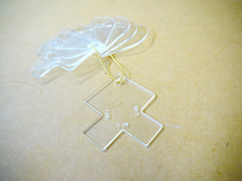

# 01.データの設定
  

## ★データ作成に使用するソフトウェアの例
 

**2Dデータ**

* **Adobe Illustrator（有料）：** [http://www.adobe.com/jp/products/illustrator.html](http://www.adobe.com/jp/products/illustrator.html)

* **Inkscape（無料）：** [https://inkscape.org/ja/](https://inkscape.org/ja/)

* **Method Draw（無料）：** [http://editor.method.ac/](http://editor.method.ac/）)

 

**3Dデータ**

* **Rhinoceros （有料）：** [http://www.rhino3d.co.jp/](http://www.rhino3d.co.jp/)  

* **Autodesk FUSION360（無料）：** [http://www.autodesk.co.jp/products/fusion-360/overview](http://www.autodesk.co.jp/products/fusion-360/overview)

 

**コーディング**

* **JS outputs SVG：** [http://fabacademy.org/archives/2014/students/oami.takuma/computer\_controlled\_cutting.html](http://fabacademy.org/archives/2014/students/oami.takuma/computer_controlled_cutting.html)

* **Processing：** [https://processing.org/](https://processing.org/)

* **Open SCAD：** [http://www.openscad.org/](http://www.openscad.org/）)
 
 

## ★データ形式
 

.ai、.dxf、.svg、.jpgなどのAdobe Illustratorで読み込み可能な形式 
※Adobe Illustratorからレーザーカッター用ソフトウェアにデータを送信する必要があるため。

 
 

## ★必要なデータ
 

* **加工データサイズ：** 最大600mm x 300mm

* **カラーモード：** RGB

* **カット線：** カラー R 255 G 0 B 0 ／ 太さ 0.001mm

* **彫刻：** カラー R 0 G 0 B 0

※ただし、カット線および彫刻部分のカラー設定は上記の限りではない。

 

  

（左：データ例 ／ 右：データを元にアクリル板を加工したもの）

 
 

## ★データ作成時の注意

* 文字ツールで入力した文字はアウトライン化すること！

* 切断線は、なるべく結合した状態にしておくこと！ 
（データの読み込みや、実際の加工スピードが早くなるため）
