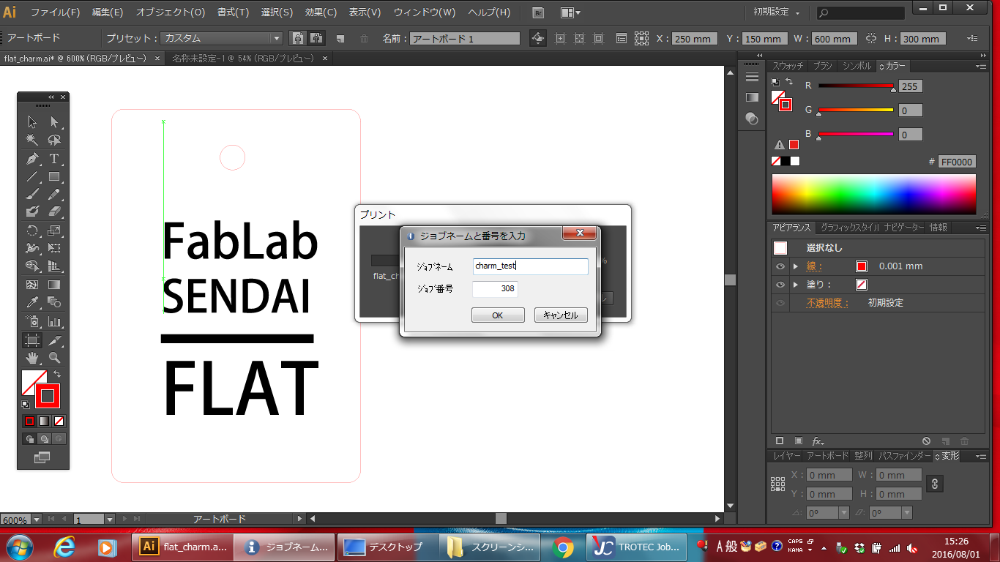

# 02.Adobe Illustratorからのデータ送信
  

## 02.1 データ設定
 

 
 

各種ソフトウェアで作成したデータをAdobeIllustratorで開き、以下のとおりに設定します。 
* **加工データサイズ：** 最大600mm x 300mm
* **アートボードサイズ：** 600mm x 300mm
* **カラーモード：** RGB
* **カット線：** カラー R 255 G 0 B 0 ／ 太さ 0.001mm
* **彫刻：** カラー R 0 G 0 B 0
 
 
 
 

## 02.2 プリント設定 (1)
 

 

**“ファイル”** ＞ **“プリント”** を選択します。 
 

 

**「用紙サイズ」** を **「User defined Paper」**に設定し **“プリンター”**をクリックします。 
※特殊な設定をしなくても良い場合スキップしてOKです。 
 

 
 

警告ウィンドウが表示されたら**“続行”**を選択し **“詳細設定”**をクリックします。 
※特殊な設定をしなくても良い場合スキップしてOKです。 
 
 
 

## 02.3 プリント設定 (2)
 

※特殊な設定をしなくても良い場合スキップしてOKです。 
 

 

各項目を下記のように設定します。 
 
### ★サイズ設定

* **"User -defined Size"**を選択する
* **"Minimize to Jobsize"**にチェックを入れる
* 幅 602mm、 高さ 302mmに設定する
 

### ★材料設定
 

ここは後ほど改めて設定するので、どちらも**"Standard"**を選択する。 
 

### ★加工オプション

* **加工モード：**標準
* **解像度：**333dpi（250dpi以下を選択すると、カット線が認識されないというバグがあるので注意）
* **カットライン：**無し
* **ハーフトーン調整：**カラー

※各項目の詳細は、「06.注意・備考」ページを参照のこと。 
 
 
 

## 02.4 設定完了
 

 

設定が完了したら、ウィンドウ左下の**“JC”**をクリック。 
 
 

 

**“印刷”**をクリックする。 
 
 

 

**“プリント”**をクリックする。 
 
 
 

## 02.5 ジョブネームの設定
 

 

trotecでは各加工データが**“ジョブ“**として蓄積されるため、それぞれに名前をつける必要がある。 
名前には半角英数文字のみを使用すること。入力完了したら**“Apply”**をクリックする。
