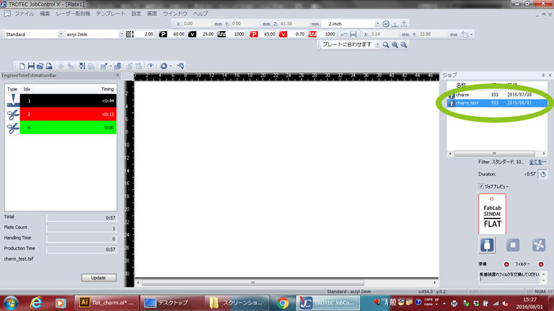
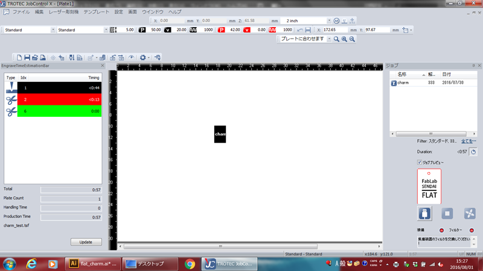
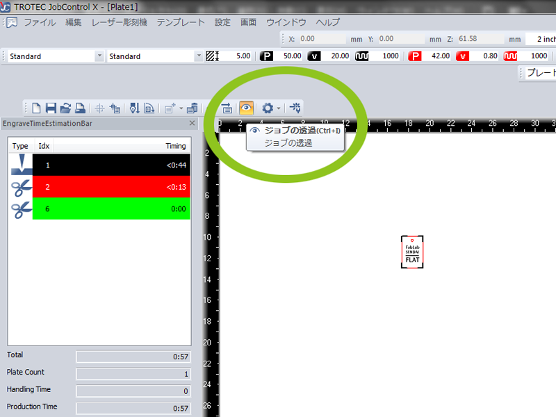
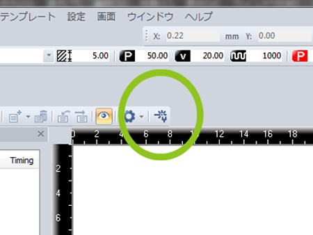
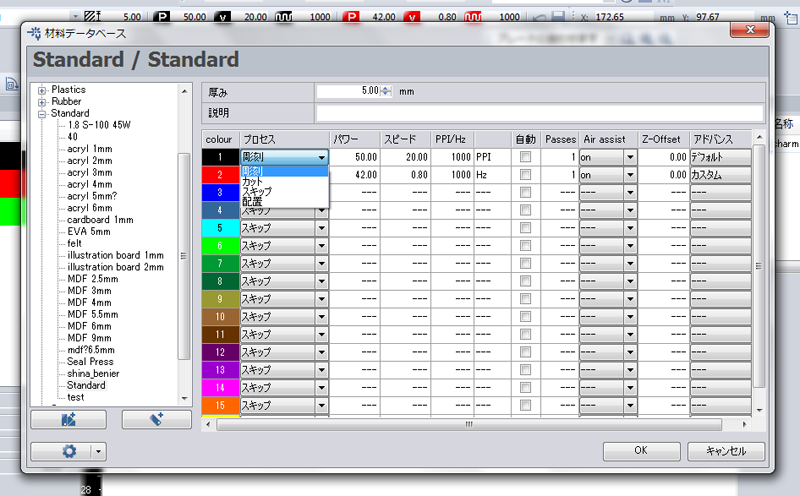

# 03.JobControlのセット
  

## 03.1 ジョブの読み込み
 

 

Adobe Illustratorでジョブに名前をつけ、**“Apply”**をクリックすると、 
マシンを操作するためのソフトウェア**「TROTEC JobControl X」**が起動します。 
画面右側のジョブリストの中に、先ほど作成したジョブが表示されているかを確認します。 
 
 

 

ジョブネームをダブルクリックすると、Plateと呼ばれる中央のエリアにジョブが配置されます。 
加工開始ボタンを押すと、このPlateエリアに表示されているジョブに応じて加工が行なわれます。 
 
 

 
 

画面上部のツールバーに表示されている**“ジョブの透過”**ボタンをクリックすると、 
それまで黒く表示されていたジョブ（加工データ）が、元のデータ通りに表示されます。 
  

### ★線や画像が表示されない場合

* Adobe Illustrator上での線や画像の色設定、及びカラーモードがRGBになっているかを確認します。
* 画面左の**"EngraveTimeEstimationBar"**に、 
データ作成に使用した色が表示されているかどうかを確認します。 
（されていない場合、後ほど設定で表示させることができるのでこのままでOKです。） 
 
 
 

## 03.2 レーザーのパワーや加工速度の設定
 

 

画面上部の**“材料テンプレートの設定”**ボタンを押します。 
 

 

材料データベースウィンドウが表示されます。 
加工データ作成時に設定した色ごとに、加工のプロセスやレーザーのパワー、加工スピードを設定します。 
（画面左部から、使用する素材名を選択することでも設定可能です。） 
設定が完了したら**“OK”**ボタンをクリックします。 
  

### ★各項目の内容
* **color：**加工データ上での色。カラーボックスの上にカーソルを合わせると、 
カラー列の下部にRGBの色成分数値が表示されます。
* **プロセス：**色ごとの加工内容を設定。
    - **彫刻：**ぬりつぶすように、画像部分が削られます。
    - **カット：**ラインに沿ってレーザーが動き、素材が切断されます。
    - **スキップ：**チェックを入れると何も加工されません。Plate上でも非表示となります。
    - **配置：**Plate上では表示されるが、加工はされません。
* **パワー：**レーザーのパワー（最大出力に対するパーセンテージ。0〜100%まで設定可能です。）
* **スピード：**レーザーの加工速度。最速2.8m/秒。 
（最大スピードに対するパーセンテージ。0〜100%まで設定可能です。）
* **PPI/Hz：**
    - **PPI（彫刻）：**1インチあたりのレーザーパルス数。 
    基本的に1000PPIでOK。dpiと異なり、PPIが増加しても加工時間に影響はありません。
    - **Hz（カット）：**カット時のレーザーパルスの周波数。基本的に1000HzでOKです。
* **自動：**PPIまたはHzの設定値が自動的に設定されます。
* **Passes：**色ごとの加工の繰り返し数を設定。
* **Air Assist：**空気噴射のON,OFFを切り替えられます。基本的にONに設定しておきます。
* **Z-Offset：**ベッドの高さを調整可能だが、必要でない限り0.00に設定します。
* **アドバンス：**必要でない限りデフォルトに設定します。
