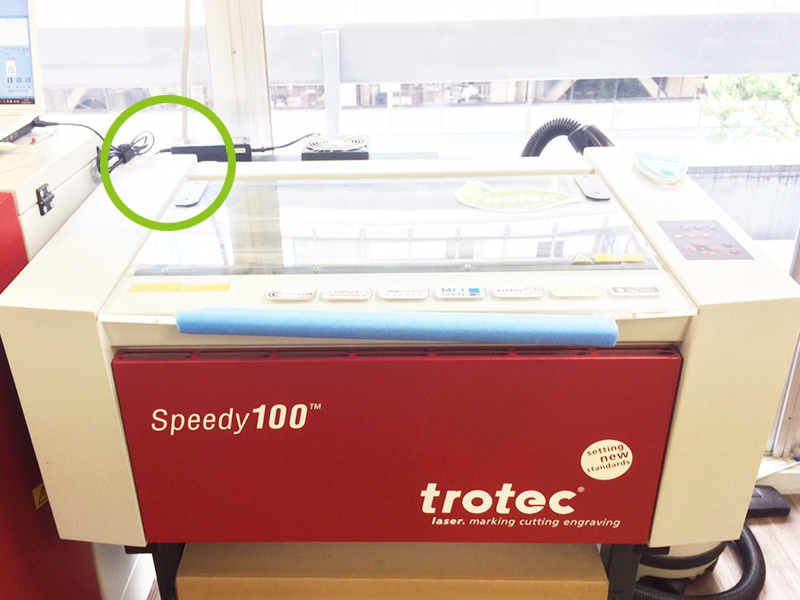
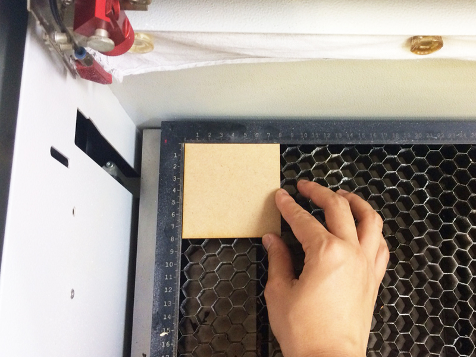
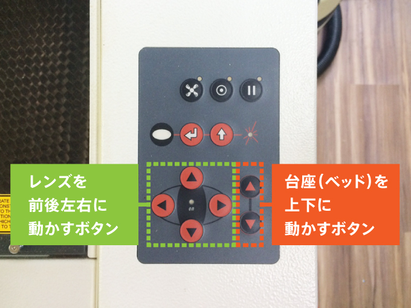
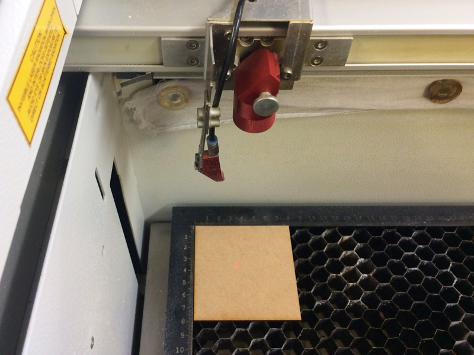
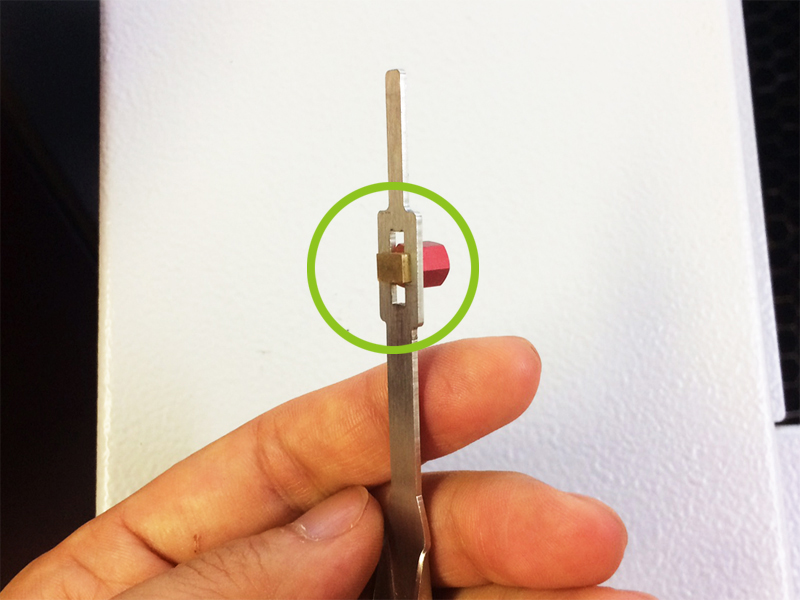
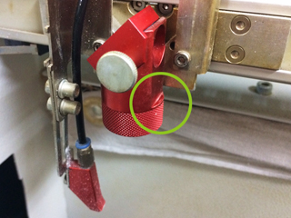
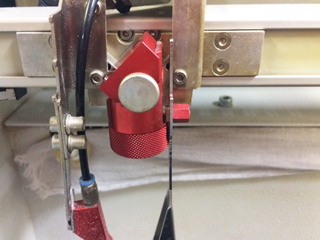
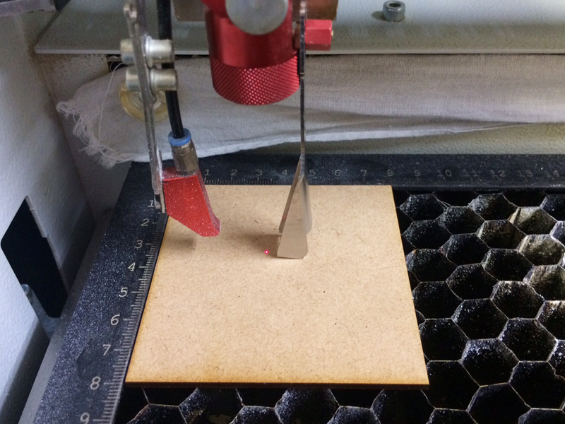
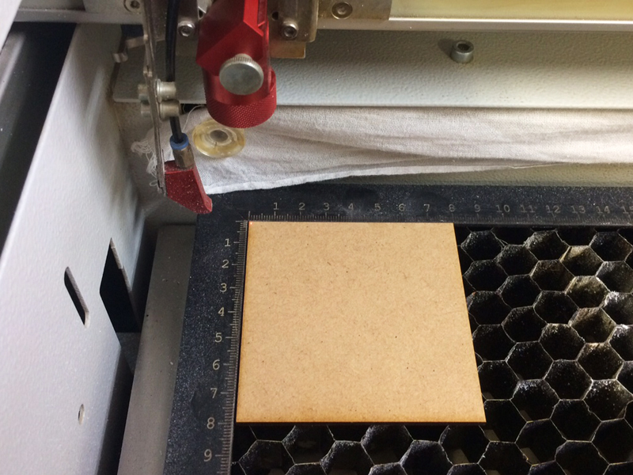

## 04.マシンのセットアップ
 

#### 04.1 マシンの起動
 

 

マシン上部の蓋を閉めた状態で、マシンの左裏についているスイッチを押し、電源を入れる。 
（写真内の緑の丸のあたりにスイッチがある。） 
すると、マシン内部の台座（テーブル／ベッド）が降下を始め、 
一番下まで下がり切ると『ピーッ』というアラーム音がなり、起動が完了する。 
また、このときに集塵機の電源が入ったかどうかも必ず確認すること。 
 

##### ★起動時の確認事項

* マシン上部の蓋は閉まっているか。

* 電源を入れる前に、加工テーブルの上には何も載っていないか。

* X軸アームは自由に動く状態か。（X軸レールの上にゴミ等がはさまっていないか）

* 加工テーブルの下には何も入っていないか。（ハニカムテーブルが傾いていないか）
 
 
 

#### 04.2 素材の設置
 

 

素材をベッドの上に置く。基本的に、素材の左上部分がベッドにぴったりを沿うように設置すると良い。 
 
 
 

#### 04.3 レーザー焦点距離の調整
 

レーザーカッターは、レーザー光の熱で様々な素材を加工する。 
そのしくみは、虫眼鏡で太陽光を集め、その熱によって紙を燃やすことができるという現象と近い。 
（参照：http://rikasapo.yagami-inc.co.jp/elementary/3nen/3-04.php?tab=3） 
そのため、綺麗に加工をするためには、レンズと素材との距離をきちんと設定する必要がある。 
 

 

レンズと台座の位置は、マシン右手の操作パネルで変えることができる。 
矢印ボタン以外には基本的に触らないこと。 
また、このピント調整時に最もマシンを破損しやすいので、必ず注視しながら操作すること。 
  

 

レーザーの基準点として、赤いマーカー（レーザーポインター）が照射される。 
それが素材の中心あたりに来るように、レンズを操作パネルで移動させる。 
  

 

レンズと素材の距離を合わせるのには、写真のようなピント合わせ棒を用いる。 
  

  

ピント合わせ棒の金色の突起部分を、レンズのパーツ横の段差（緑の丸部分）にひっかけて使用する。 
  

 

操作パネルでマシンの台座の位置を上昇させ、 
素材上面にピント合わせ棒の先端が触れるように高さを調整する。 
  

 

操作パネルで、赤いマーカーを加工原点位置に移動させる。
