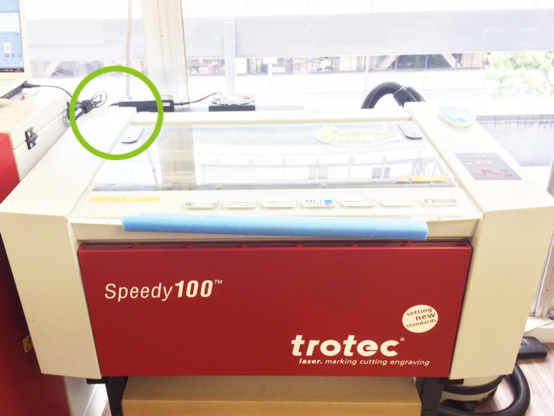
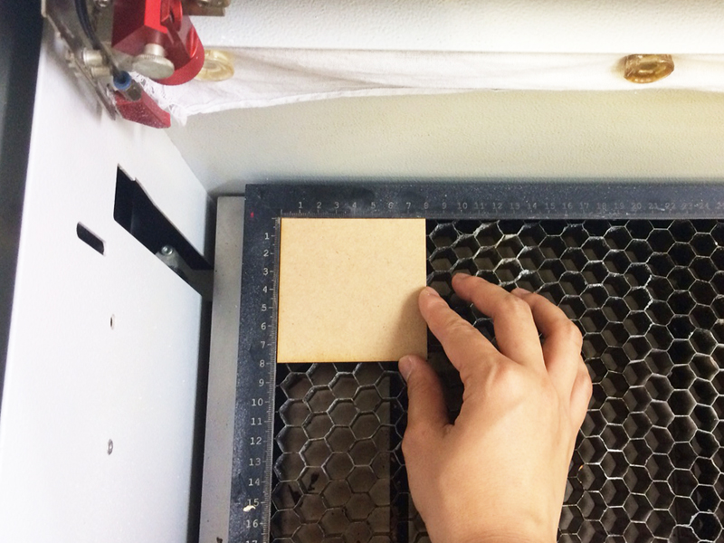
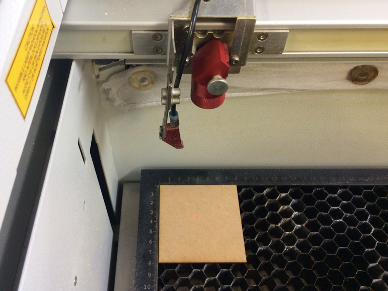
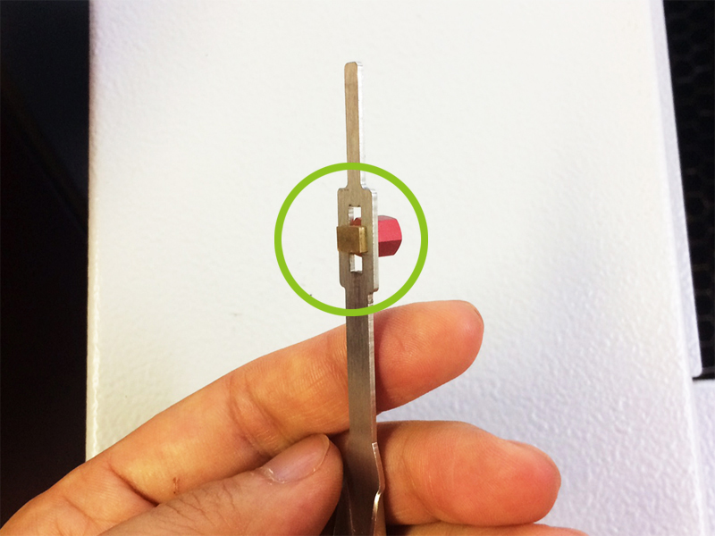
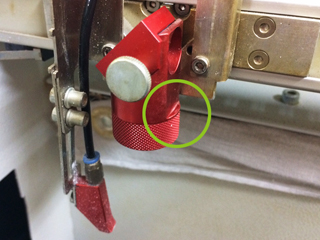
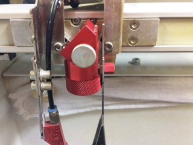
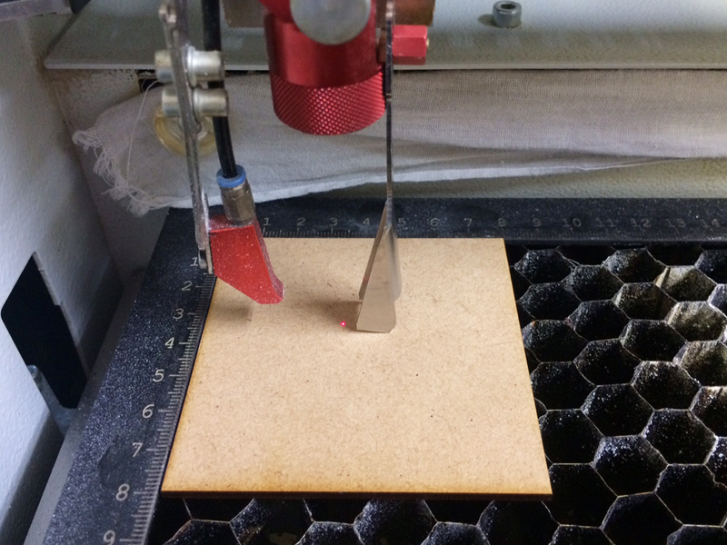
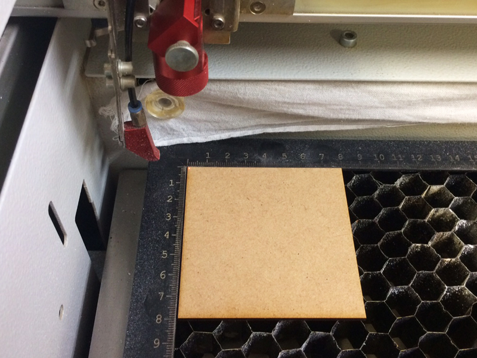

# 04.マシンのセットアップ
  

## 04.1 マシンの起動
 

 

マシン上部の蓋を閉めた状態で、マシンの左裏についているスイッチを押し、電源を入れます。 
（写真内の緑の丸のあたりにスイッチがあります。） 
すると、マシン内部の台座（テーブル／ベッド）が降下を始め、 
一番下まで下がり切ると『ピーッ』というアラーム音がなり、起動が完了します。 
また、このときに集塵機の電源が入ったかどうかも必ず確認してください。 
 

### ★起動前の確認事項

* マシン上部の蓋は閉まっているか。
* 電源を入れる前に、加工テーブルの上には何も載っていないか。
* X軸アームは自由に動く状態か。（X軸レールの上にゴミ等がはさまっていないか）
* 加工テーブルの下には何も入っていないか。（ハニカムテーブルが傾いていないか）
 
 
 

## 04.2 素材の設置
 

 

素材をベッドの上に置きます。素材の左上部分がベッドにぴったりを沿うように設置するとセットしやすいです。 
 
 
 

## 04.3 レーザー焦点距離の調整
 

レーザーカッターは、レーザー光の熱で様々な素材を加工します。 
虫眼鏡で太陽光を集め、その熱によって紙を燃やすことができるという現象と近いしくみです。 
（参照：[http://rikasapo.yagami-inc.co.jp/elementary/3nen/3-04.php?tab=3](http://rikasapo.yagami-inc.co.jp/elementary/3nen/3-04.php?tab=3)） 
そのため、綺麗に加工をするためには、レンズと素材との距離をきちんと設定する必要があります。 
 

 

レンズと台座の位置は、マシン右手の操作パネルで変えることができます。 
矢印ボタン以外には基本的に触らないこと。 
また、このピント調整時に最もマシンを破損しやすいので、必ず注視しながら操作してください。 
  

 

レーザーの基準点として、赤いマーカー（レーザーポインター）が照射されます。 
それが素材の中心あたりに来るように、レンズを操作パネルで移動させます。 
  

 

レンズと素材の距離を合わせるのには、写真のようなピント合わせ棒を用います。 
  

  

ピント合わせ棒の金色の突起部分を、レンズのパーツ横の段差（緑の丸部分）にひっかけて使用します。 
  

 

操作パネルでマシンの台座の位置を上昇させ、 
素材上面にピント合わせ棒の先端が触れるように高さを調整します。 
  

 

操作パネルで、赤いマーカーを加工原点位置に移動させます。
