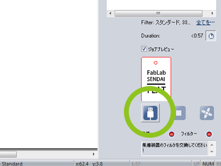
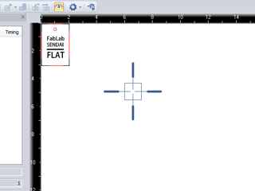
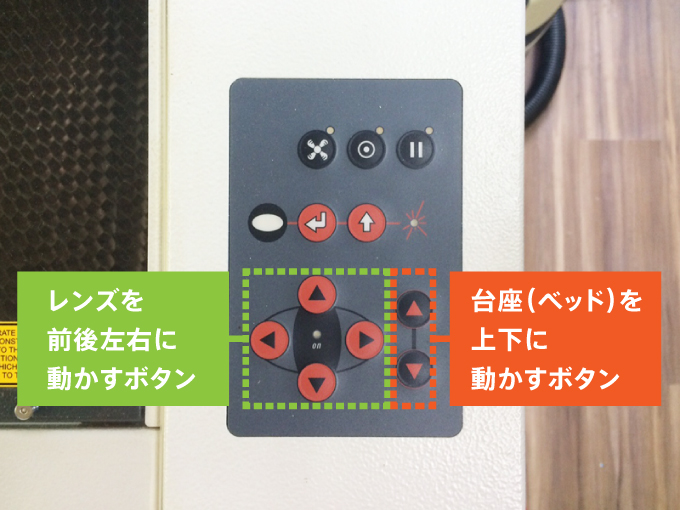
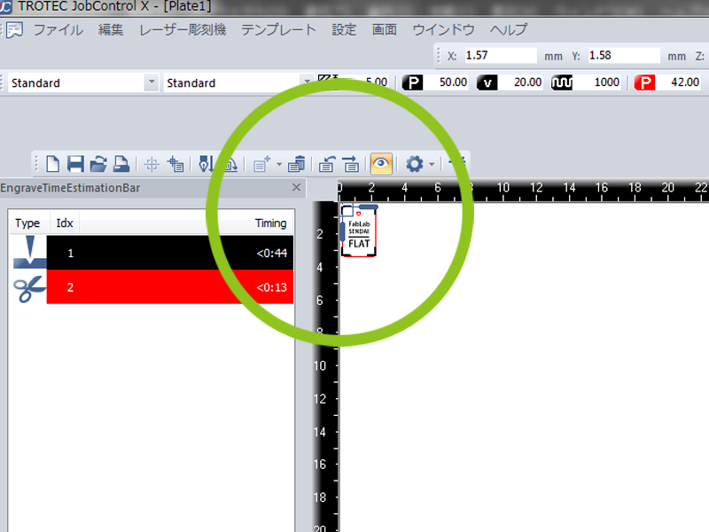
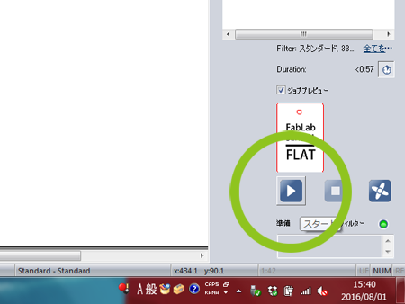
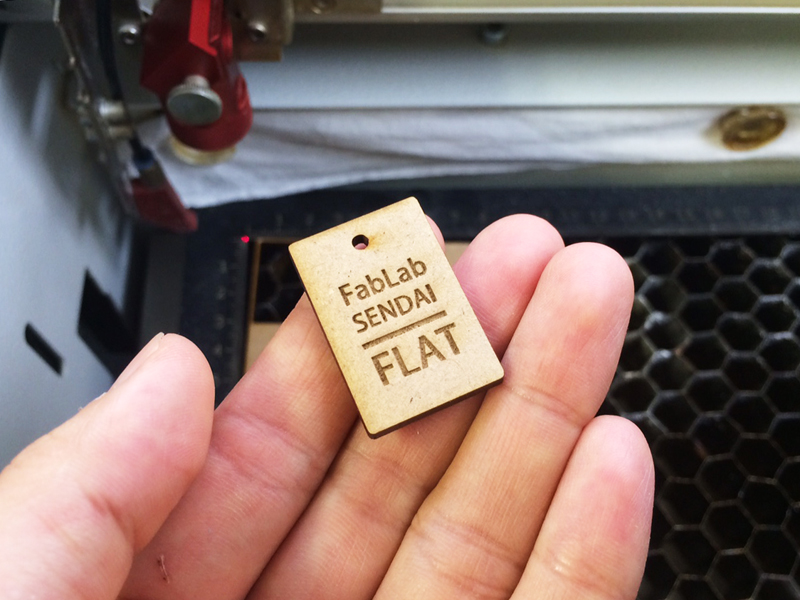

# 05.マシンとPCの接続〜加工 (1)
  

## 05.1 マシンとPCの接続
 

 

**JobControl**の右下部の**USBコネクタマーク**のボタンをクリックするとマシンとPCが接続されます。 
（USBコネクタマークから、右向き三角形（再生マーク）に表示が変わればOKです。） 
 
 
 

## 05.2 データ加工位置の設定
 

 

PCとマシンの接続が完了すると、レーザーポインターの位置を示す青い十字マークが表示されます。 
 

 

マシン左側の操作パネルのレンズを前後左右に動かすボタンで、レンズの位置を移動させます。 
基本的に左上が加工の原点になるように設定すると分かりやすいです。 
 

 

加工データの左上が、青い十字マークのセンターにぴったり合うようにドラッグします。 
（データを近づけると、マグネット機能により自動的にくっつくようになっています。） 
 
 
 

## 05.3 加工開始
 

 

マシンの蓋が閉まっていることを確認してから、画面右下の**スタートボタン**を押すと加工が開始します。 
 
 
 

## 05.4 加工完了
 

 

加工が完了すると、マシンから「ピー」というアラーム音が聞こえます。 
そうしたら蓋を開け、素材を取り出します。 
加工が完了したデータは、左クリックで選択し、 
**Deleteキー**を押すとPlate（加工エリア）から消すことができます。 
