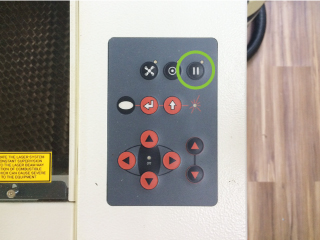
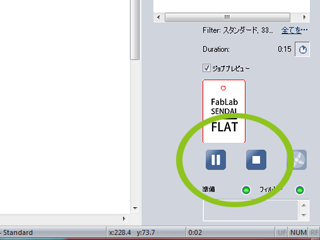
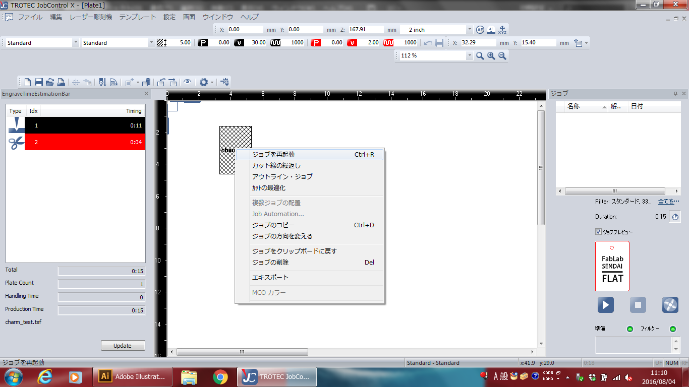
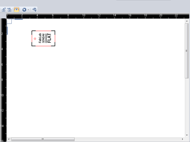
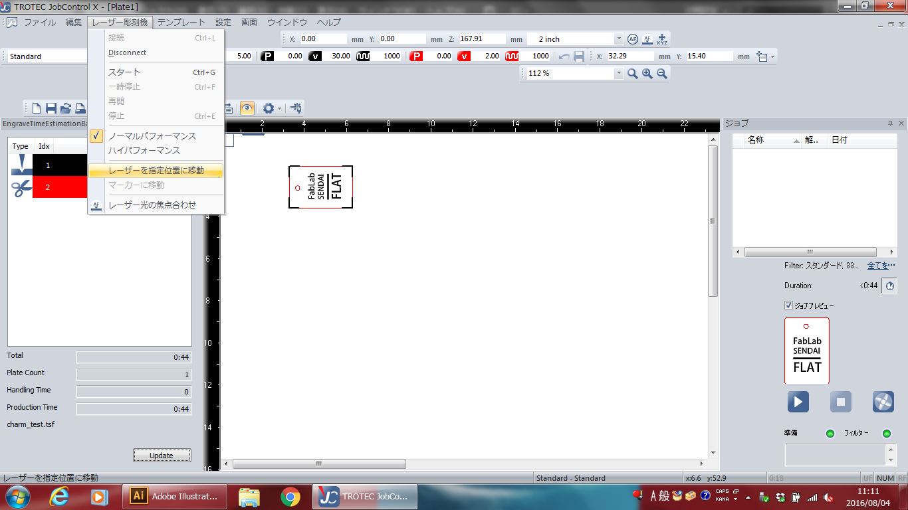
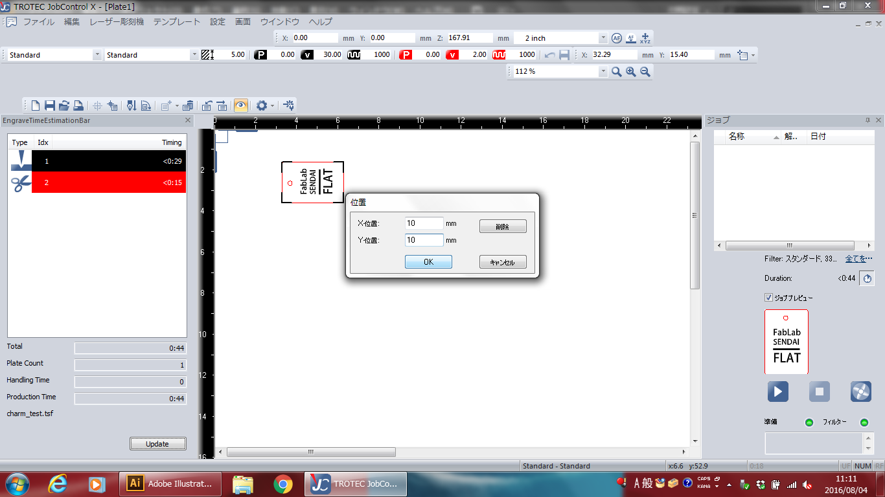

# 06.加工(2)
  

## ★一時停止、加工中断する
 

**（方法1）操作パネルでの一時停止操作**

 

マシン操作パネルの一時停止ボタンを押すと加工が一時停止します。 
再開する場合は同じボタンをもう一度押します。 
  

**（方法2）JobControlでの一時停止、加工中断操作**

 

画面右下の一時停止ボタンを押すと加工が一時停止し、白色四角のボタンを押すと加工が終了します。 
一時停止ボタンは、もう一度押すと加工が再開されます。 
 
 
 

## ★同じ加工データでもう一度加工する
 

 

加工データは、一度使用するとそのままでは再度使用できません。 
再度加工したい場合は、**データの上で右クリック** をし、**“ジョブを再起動”**を選択します。 
 
 
 

## ★加工データの向きを変える
 

  

向きを変えたいデータの上で右クリックをし、**“ジョブの方向を変える”**をクリックします。 
 
 
 

## ★原点の位置を数値で設定する
 

 

はじめに、マシンとPCを接続し、マシンの蓋を閉めます。 
その後、 **“レーザー彫刻機”** ＞ **“レーザーを指定位置に移動”**を選択します。 
 

 

任意の値を入力し**「OK」**を押すと原点の位置が移動します。 
