# 07.メンテナンス
  

※以下の作業を行なうときには、必ずマシンの電源を切ること。※ 
 
 

## ★集じん機まわり
 

**【 レーザーカッター内排気口へのフィルターの取り付け 】** 

フィルターの目が詰まってきたら交換します。 

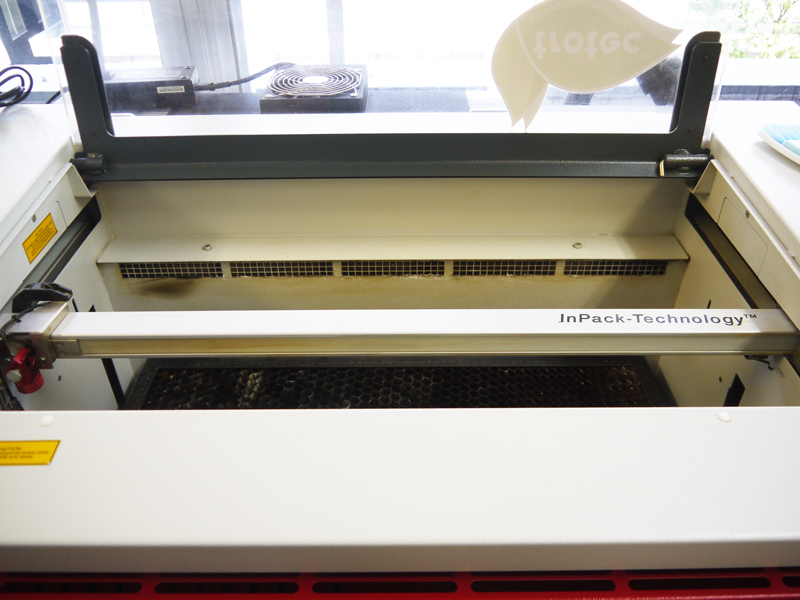 

レーザーカッター内には、加工時に発生した煙等を吸い込む排気口があります。 
 

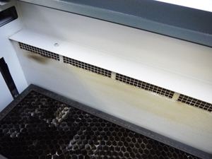 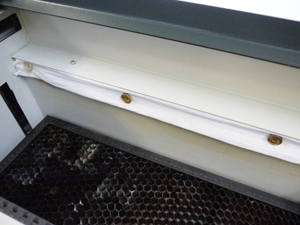 

そこに、磁石などで換気扇用フィルターやガーゼを取り付けることで、 
集じん機内のフィルターの劣化を抑えることができます。 
※ただし、加工時に火花などが発生した場合に燃え移る可能性があるため注意が必要です。 
  

**【 集じん機内のフィルターの交換 】** 

加工時にマシン内に煙がたまってきたり、集じん機からアラームがなったらフィルターを交換します。 

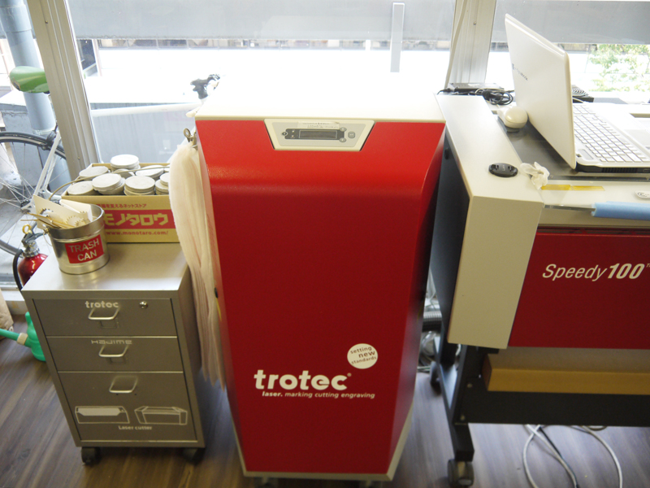 

trotec speedy100には、集じん機が付属していています。 
 

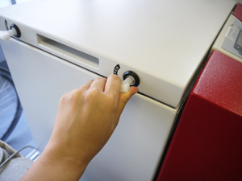 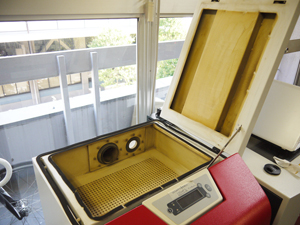 

集じん機上部のフタ左側に付いているロックを解除すると、写真右のように開くことができます。   
 

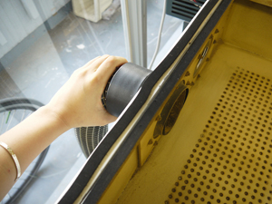 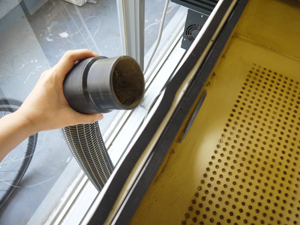 

集じん機内奥のホースを取り外します。 
 

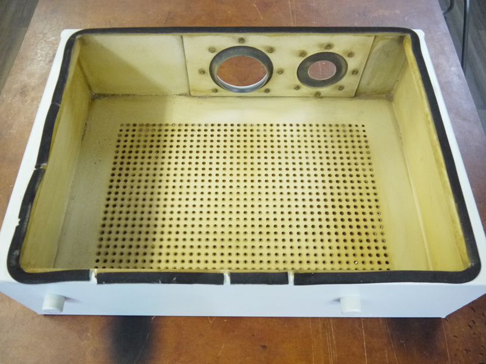 

箱を取り出したら、中に付着したススなどを綺麗に拭き取ります。 
 

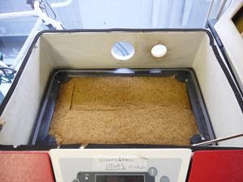 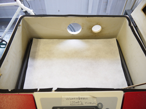 

箱の下には、さらにボックス型フィルターが内蔵されています。 
その上に、写真左のようにスポンジ状のフィルターを置き、 
さらに写真右のように薄い白色フィルターを乗せます。 
この後は、上記と逆の手順で箱を戻し、ホースを取り付け、フタを閉じます。 
 
 
 

## ★レンズまわり
 

**【 レンズ（1）】** 

レーザーのパワーが弱くなってきたと感じたときや、1日の終わりに必ず実施します。 

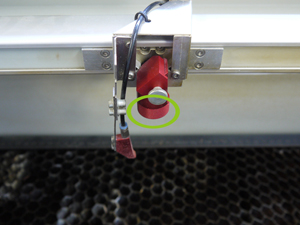 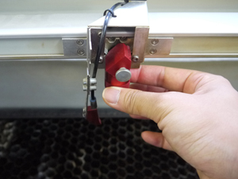 

レンズ下部のパーツを時計回りに回してレンズを取り外します。 
このとき、パーツやレンズが落ちないよう、必ず左手を添えて作業します。 
 

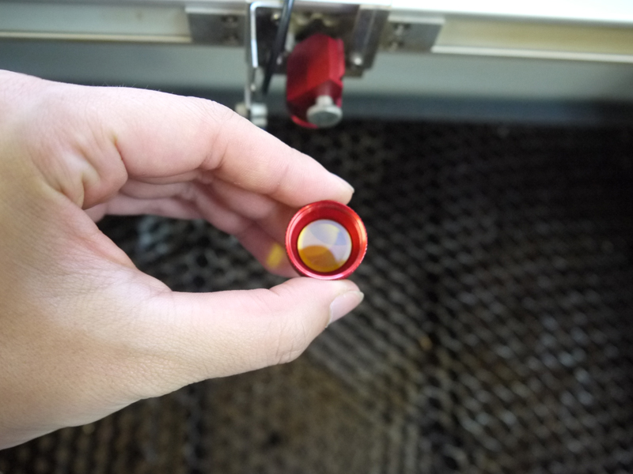 

クリーナー液をレンズに垂らし、ウエスで汚れを拭き取ります。 
  

**【 レンズ（2）】** 

レーザーのパワーが弱くなってきたと感じたときや、1日の終わりに必ず実施します。 

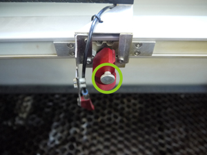 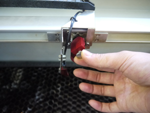 

レンズ上部のシルバーのネジを反時計回りに回して外します。 
こちらもレンズ(1)と同様に、左手を添えながら作業します。 
 

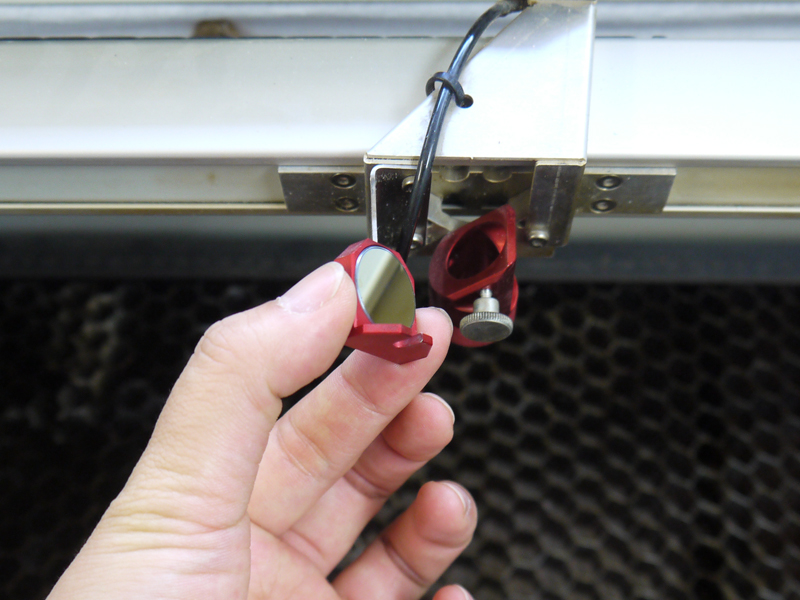 

パーツの裏側に付いているミラーにクリーナー液を垂らし、ウエスで汚れを拭き取ります。 
  

**【 レンズ（3）】** 

レーザーのパワーが弱くなってきたと感じたときや、1日の終わりに必ず実施します。 

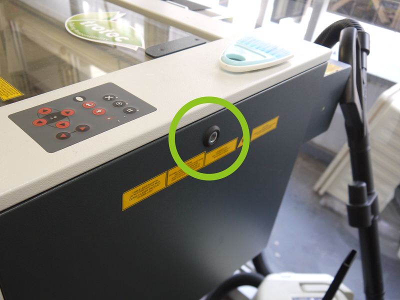 

マシン右側のロック部を六角レンチで開けて、壁部分を取り外します。 
 

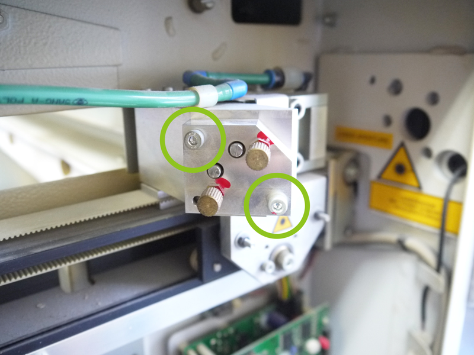 

上部に写真のような箇所があります。その中の、緑の丸で囲まれているネジを外します。 
 

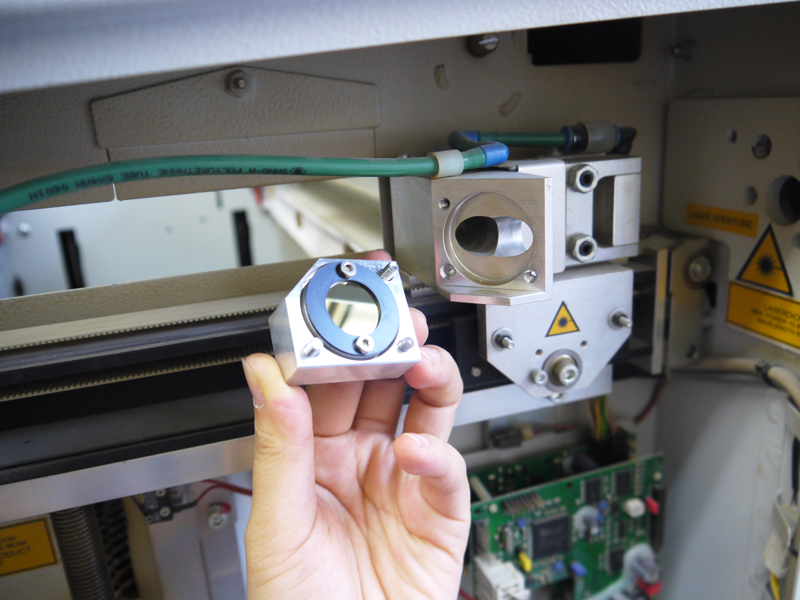 

パーツの内側に付いているミラーにクリーナー液を垂らし、ウエスで汚れを拭き取ります。 
 
 
 

## ★マシン内の掃除
 

ベルト部分やマシン内部の壁などに付着したススは綺麗に拭き取ります。 

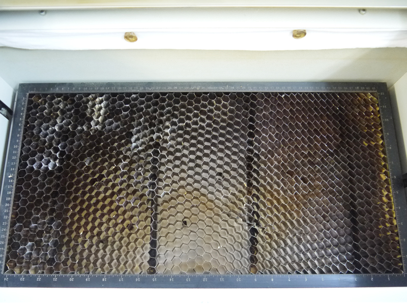 

ハニカムテーブルをマシンから外し、その下に落ちている細かなパーツやゴミも必ず取り除くこと。 
 
