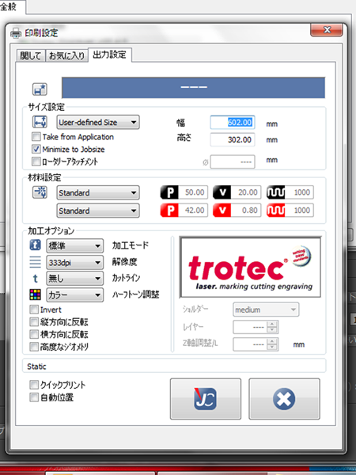

# 08.注意・備考
  

## ★レーザー加工について
 

レーザー加工は、レーザー光の熱で様々な素材を加工します。 
虫眼鏡で太陽光を集め、その熱によって紙を燃やせるという現象に近いしくみです。 
そのため、綺麗に加工をするためには、レンズと素材との距離をきちんと設定する必要があります。 
加えて、素材によっては切断面や彫刻面が焦げたような仕上がりになる点を考慮しなければいけません。 

また、レーザーはパワーや加工速度を一度設定すると、加工が完了するまで 
設定内容を変更できないため、表面がなるべく平らで密度が一定な素材の加工に適しています。 
 
 
 

## ★データの作成について
 

* ドキュメントのカラーモードがRGBになっているか必ず確認すること。
* パスの数が多いと、IllustratorからJobControlにデータを送るのに時間がかかるため、 
パスの数が多い場合は複数に分けて加工するのがおすすめです。 
 

**【 機材利用時の注意 】**

* **​機材稼動時は、絶対に機材のそばにいること。** 
レーザーカッターは稼動時に火が出る可能性があり、それにより火災が発生したという事例もあります。
  * [http://fab.cba.mit.edu/content/tools/universal\_laser/](http://fab.cba.mit.edu/content/tools/universal_laser/)  
  * [http://blog.goo.ne.jp/rucco075/e/0060fe18904a2f608f83c2b14f0c312a](http://blog.goo.ne.jp/rucco075/e/0060fe18904a2f608f83c2b14f0c312a)
 
 

* **“塩化◯◯”という素材は加工厳禁。** 
人体に有毒なガスが発生するのに加えて、マシン内部を腐食してしまい稼働できなくなります。

  * [http://comnet-blog.jugem.jp/?eid=273](http://comnet-blog.jugem.jp/?eid=273)  
  * [http://www.laserworks.jp/blog/maintenance/post-162.html](http://www.laserworks.jp/blog/maintenance/post-162.html)
 
 

* **湾曲した板の加工は要注意。** 
  曲がってしまった板も、捨て板に両面テープやマスキング・テープで固定することで 
  水平に固定することができますが、レーザーカットされたパーツが反り返り 
  思わぬアクシデントを起こすことがあります。 
  （熱で変形しやすい素材についても同様のアクシデントが発生する可能性が大いにあります。） 
  ※FLATで実際に起こった事故とその解決策をまとめた記事はこちら↓ 
  [あやうし！トロテックレーザーで気をつけたいこと。](https://fablabsendai-flat.com/trotec-tips01/)
 
 
 

## ★加工オプションについて
 

 
 

加工オプションの各項目の詳細は下記のとおりです。  

**【 加工モード 】**

  * **標準：**通常の切断、彫刻加工時に使用。
  * **スタンプ：**レーザー彫刻でスタンプを作成する際に使用。 
  RGB000で彫刻データを作成すると、自動的にカラー反転とミラー化が実行されます。 
  カット線には任意の色を使用可能。
  * **レリーフ：**グレースケール画像を読み込むと、1度の加工の中で、 
  白黒の濃淡に応じてレーザーのスピードを調節しながら3次元の彫刻加工として実行されます。
  * **レイヤー：**グレースケール画像を読み込むと、 
  数回の加工に分けて加工が実行され、3次元的な彫刻加工に仕上がります。
  * **写真を最適化：**高解像度の写真を最高の品質で彫刻加工することが可能です。 
  （ただし、常に高品質モードで処理されるため加工に時間を要します。）
  * **シール：**カッティングシートの切断時等、2層になった素材の上の層のみをカットする際に使用。
  

**【 解像度 】** 

1インチ（25.4mm）あたりの彫刻線の本数を設定。 
値が大きいと仕上がりが綺麗になるが、彫刻そのものの深さが増し、加工時間も増加します。 
また、250dpi以下を選択すると、カット線が認識されないというバグがあるので注意です。 
（標準は333dpi〜500dpi） 
  

**【 カットライン 】** 

自動的に生成されるカットライン（RGB 255, 0, 0）を選択します。

  * **無し：**カットラインは生成されません。（データ上で設定したカット線のみ加工されます。）
  * **四角弧：**加工データのサイズに正確に沿った四角形のカット線が生成されます。
  * **円弧：**加工データのサイズに従ったサイズの円形のカット線が生成されます。
  * **変更可能：**彫刻画像の輪郭にぴったりと沿ったカット線が生成されます。
  

**【 ハーフトーン調整 】** 

ハーフトーンとは、グレースケールもしくはカラーのイメージを白黒のイメージに変換し、 
ドットサイズ及びドットピッチの変更によりグレースケールイメージのように見せること。   
* **ディザ生成：**ハーフトーンの標準的な設定。明暗コントラストがソフト。
* **Stucki, Jarvis, Floyd Steinberg：**写真彫刻用の高度な設定。
* **カラー：**ドライバーによるハーフトーンが無効化されます。 
Illustrator等で複数の彫刻色を使用したデータを作成した場合、 
もしくはハーフトーンがすでに実行されている場合に使用されます。
* **モノクロ：**しきい値レベルと比較し、印刷対象のピクセルを黒と白のいずれにするのかが決定されます。
  

**【 その他 】**

* **Invert：**印刷対象イメージ内のすべての色が反転されます。
* **縦方向に反転：**印刷対象イメージが垂直方向にミラー反転されます。
* **横方向に反転：**印刷対象イメージが水平方向にミラー反転されます。
* **高度なジオメトリ：**加工データ内のカット線及び円弧、丸い輪郭の精度が向上。
* **ショルダー（スタンププロセスのみで有効）：** 
彫刻加工時の凸部分の断面をやや斜めに加工することができます。
* **レイヤー（レイヤープロセスでのみ有効）：** 
必要な彫刻レイヤー（彫刻パス）の数を2〜255の範囲内で設定可能。
* **Z軸調整（レイヤープロセスでのみ有効）：**レイヤーが1つ終了した際にテーブルが上昇する距離。
